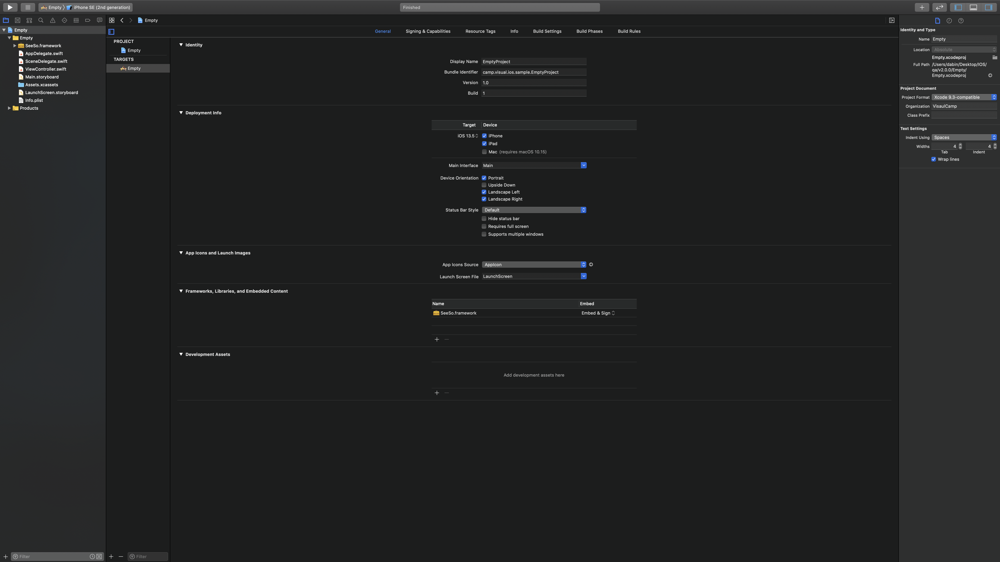
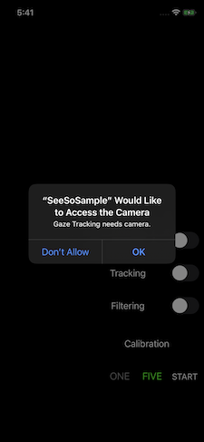
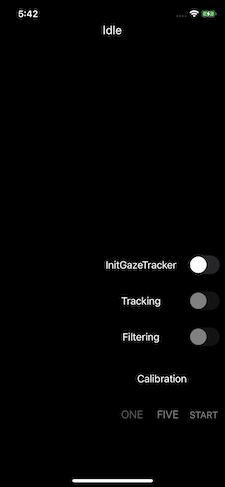
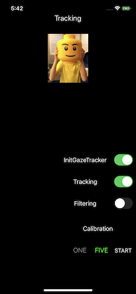
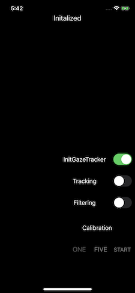
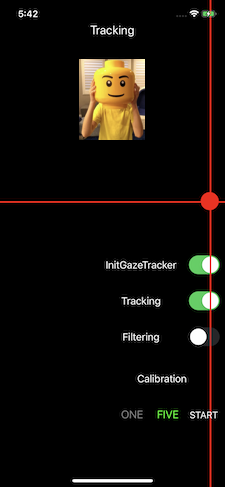
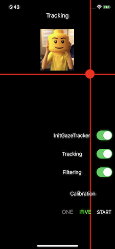
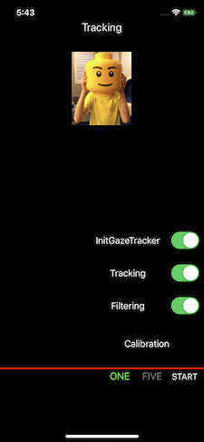

# SeeSoSample

### Index
- [App Introduction](#App-Introduction)
- [Requirements](#Requirements)
- [How to run](#How-to-run)
- [Function description of the app](#Function-description-of-the-app)

## App Introduction

 This app is designed to help you understand how GazeTracker works. This is because the functions available for each state are activated.

## Requirements

- XCode 11.5
- SeeSo.framework : 2.2.0
- Swift: 5.2
- It must be run on a **real iOS device. (iOS 13.0 +, iPhone 6s +)**
- It must be an **internet environment.**

## How to run

1. Clone or download this project.
2. Add SeeSo.framework to the project as shown below. (At this time, "copy items if needed" should be checked.)

    

    2-1 

    

    2-2

    

    2-3

3. Now change the SeeSo.framework to sign & embed as shown below.

    

    3-1

4. Sign in with your developer ID in the Signing & Capabilities tab.
5. Insert your own development key in the licenseKey into the "ViewController.swift".

    

    5-1

6. Allow camera access.

    

## Function description of the app

1. Click on the switch to activate it. SeeSo.framework's GazeTracker
To create. Deactivation again destroys the object.

    

    1-1. GazeTracker init.

    

    1-2. GazeTracker deinit

2. Clicking the switch to activate activates eye tracking. If it is deactivated again, the eye tracking is stopped.

    

    2-1. Tracking

    

    2-2. Stop Tracking

3. Click the switch to activate it, and GazePointView uses the onFilteredGaze's coordinates. If disabled again, the OnGaze's coordinates are used.

    

    3-1. Filtered Gaze

    

    3-2 Raw Gaze

4. The One Five button can only select one of the two. When selected, the color changes to green, meaning one-point calibration and five-point calibration, respectively. Click the start button next to start calibration.

    

    4-1. Five point calibration mode.

    

    4-2 One point calibration mode.

5. The top label tells you the status of each. If an error occurs, see the api documentation and deal with it.
6. The camera preview is visible when it is in eye tracking.
