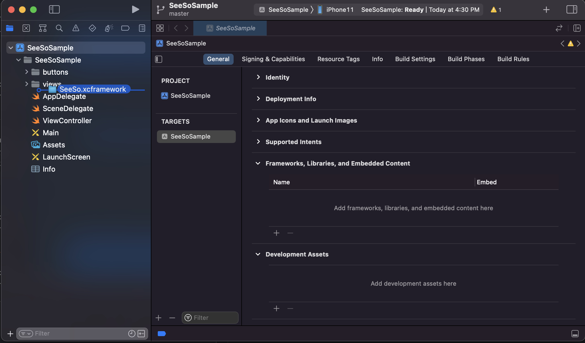
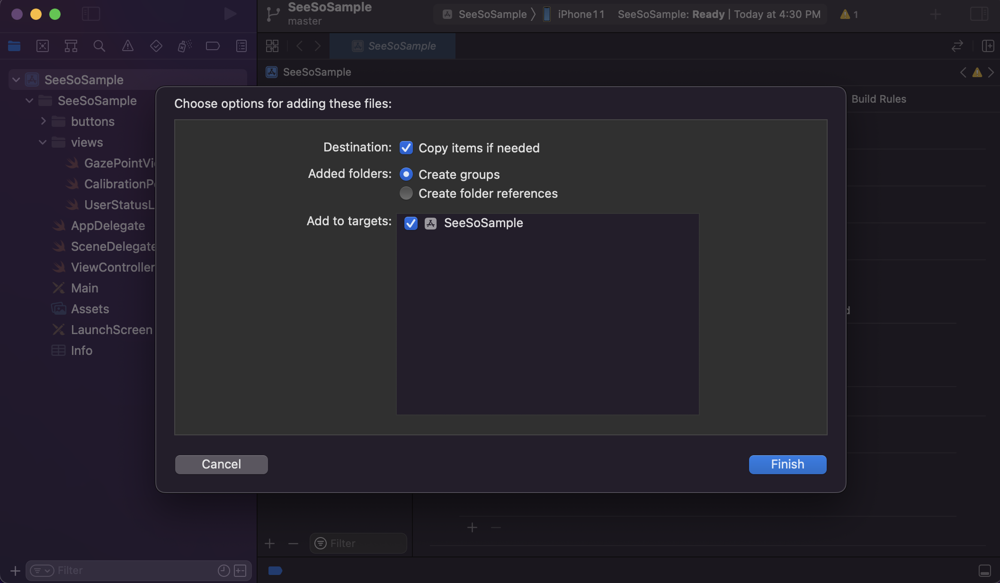
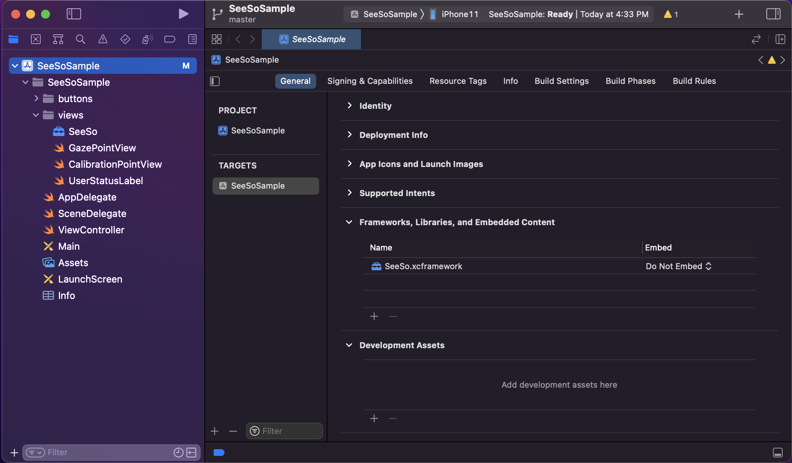
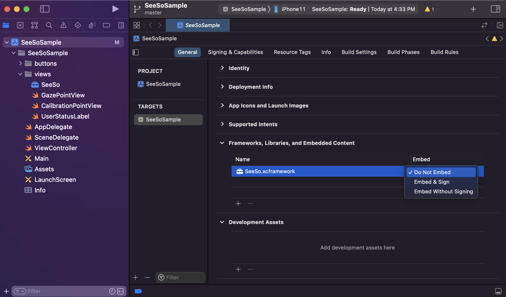

<p align="center">
    
</p>
<div align="center">
    <h1>SeeSo iOS Sample</h1>
    <a href="https://github.com/visualcamp/seeso-sample-ios/releases" alt="release">
        
    </a>
</div>

## SeeSo
SeeSo is an AI based eye tracking SDK which uses image from RGB camera to track where the user is looking.
Extra hardware is not required and you can start your development for free.
In 2021, SeeSo was recognized for its innovative technology and won GLOMO Award for Best Mobile Innovation for Connected Living!
1. Supports multi-platform (iOS/Android/Unity/Windows/Web-JS)
2. Has simple and quick calibration (1-5 points)
3. Has high accuracy and robustness compared to its competitors.

## Documentation
* Overview: https://docs.seeso.io/nonversioning/document/seeso-sdk-overview
* Quick Start: https://docs.seeso.io/nonversioning/quick-start/ios-quick-start
* API: https://docs.seeso.io/docs/api/ios-api-docs

## Requirements
* SeeSo.framework : 2.6.0
* It must be run on a **real iOS device. (iOS 13.0 +, iPhone 6s +)**
* It must be an **internet environment.**
* [SeeSo iOS SDK](https://manage.seeso.io/)
* Must be issued a license key in [SeeSo Manage](https://manage.seeso.io/)

## Setting License Key
* Get a license key from https://manage.seeso.io and copy your key to [`ViewController.swift`](SeeSoSample/ViewController.swift#L15)
   ```swift
   let licenseKey : String = "Input your key." // Please enter the key value for development issued by the SeeSo.io
   ```

## How to run
1. Clone or download this project.
2. Add SeeSo.framework to the project as shown below. (At this time, "copy items if needed" should be checked.)

    

    2-1 

    

    2-2

    

    2-3

3. Now change the SeeSo.framework to sign & embed as shown below.

    

    3-1

4. Sign in with your developer ID in the Signing & Capabilities tab.
5. Allow camera access.

    
      
## Contact Us
If you have any problems, feel free to [contact us](https://seeso.io/Contact-Us) 
